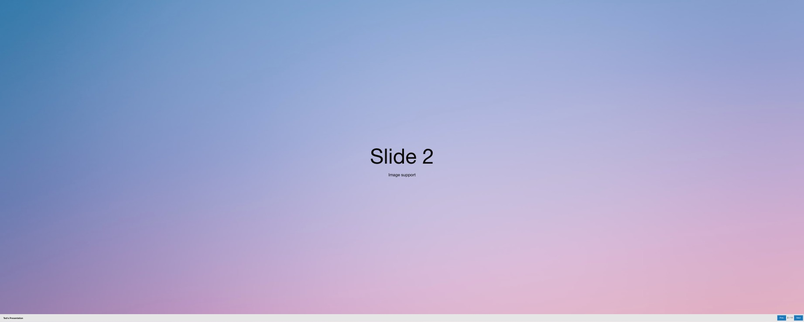
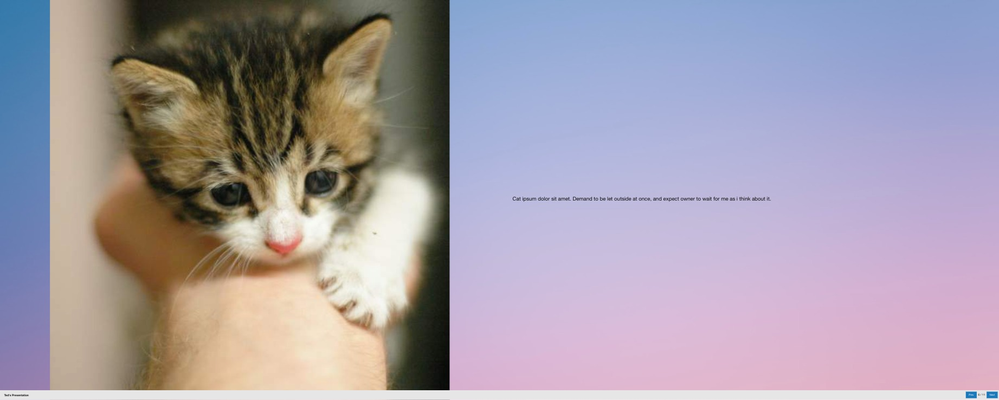
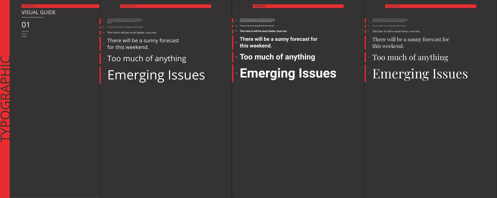
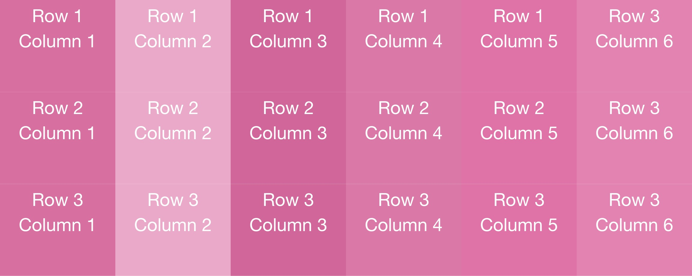
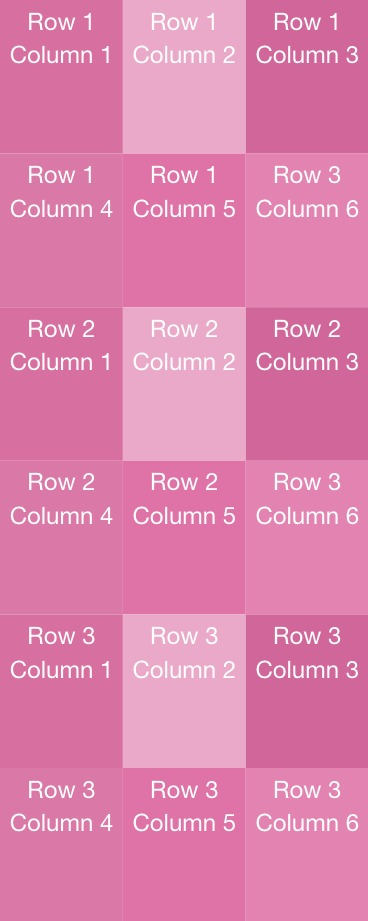
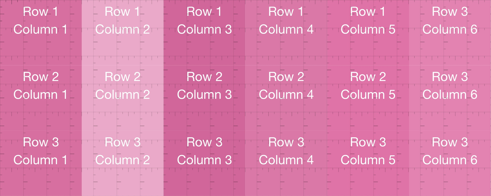

# VAST

\
Responsive Web Framework for Large Format Displays

## Quick start:

The easiest way to use Vast is to include the css file located at `/css/style.min.css`. First, create an `index.html` file. Then make a directory called `css` and paste the file into the directory. Then add this into the `<head>` of the `index.html` document:

```
<link rel="stylesheet" href="/css/style.min.css">
```

Alternatively, install node modules after initial clone or download:

```
npm install
```

Run in development mode:

```
npm start
```

Start a local development server at port 8080. Navigate to [http://localhost:8080/](http://localhost:8080/) in your browser

Build for production:

```
npm run build
```

## Overview

While responsive web design has solved the challenge of supporting multiple screen sizes, there are unique challenges creating content for displays that are beyond desktop, such as large format wall displays. These challenges include:

- **Viewing Distance**: Mobile devices and desktops are always viewed within a range of a few inches to a few feet, but large format displays may be viewed up close or at a distance of a hundred feet or more. Vast supports two viewing distances: near and far, and adjusts font sizes accordingly.

- **Fitting Content**: Mobile and desktop devices require the user to scroll to see the content in its entirety, but content for large format displays is usually meant to be instantly comprehensive - that is the content should fit the display without any overflow. Vast supports grids that make laying out content to the screen's available real estate easier.

- **Debugging**: Most content is made on a laptop, and it's difficult to imagine the size of content when it'll be put on a large format display. Vast provides a debugger that indicates, in inches, how large content will be on an large format display.

- **Aligning content to tiles**: Large format displays are often composed of a series of tiles, that may have a slight bevel that causes unintentional abberations in the content. Vast's grid can be configured to lay content out to the tile's physical borders to create an intentional, boutique implementation of the content's design.

Vast is built on top of the excellent [Foundation for Sites](https://get.foundation/sites.html) framework. Vast extends the available media queries from the existing `small, medium, large` to include a new `vast` breakpoint, ie `@include breakpoint(vast)`. The breakpoint is configured for 2000px and up.

## Emulating large format displays

It is not common to have access to a large format display to develop content for. Instead, most content creators will use their browser to emulate a large format display.

To enable device emulation in Chrome, first enter Developer Tools by pressing command+option+i. Then press command+shift+m to enable the device toolbar. It will include profiles for common mobile devices and tablets. You can create custom profiles for the large format devices that are the same pixel dimensions as a large format display [How to add a custom device preset](https://developers.google.com/web/updates/2015/07/add-a-new-custom-device-as-a-preset).

Emulation mode gives the content author a reasonable good idea of how content will appear on a large format display. See the Vast Debugger for an additional layer of understanding.

## Features

### Presentation Mode

Presentation mode enables non-engineers to create presentations for large format displays.

To create a presentation, three things are needed:

1.  An index file (.html)
2.  A series of slide files (.md)
3.  A file that organizes the slides and configures the presentation (.json)

The presentation index file (See `/ted.html` file for an example) requires a `body` structured like:

```
<body data-demo="/json/ted.json">
  <div id="controls" class="top-bar bottom"></div>
  <div class="grid-y grid-frame grid-padding-x align-middle presentation distance-near">
    <div class="cell medium-auto medium-cell-block-container align-center-middle">
      <div id="contents" class="large-down-grid-container fluid large-down-cell-block-y"></div>
    </div>
  </div>
  <script src="/main.bundle.js"></script>
</body>
```

- `data-demo` is the path to the json file (described below) and is required\
- the `#controls` div is required for presentation controls to render\
- the remaining divs are required for the presentation contents to appear correctly and should not be modified\
- the `script` tag is required and should not be modified

If Vimeo is being used in the presentation, also include the Vimeo player script tag in the `body`.

```
<script src="https://player.vimeo.com/api/player.js"></script>
```

A presentation json file is organized as follows:

```
{
	"title": "Ted's Presentation",
	"autoplay": {
		"enabled": false,
		"timeout": 5,
		"loop": false,
		"kiosk": false
	},
    "slides": [
		{
			"loc": "ted/slide-01-title.md"
		},
        {
			"loc": "ted/slide-02-background.md"
		},
  ]
}
```

The `title` attribute is displayed in the Control Bar when present.
The `autoplay` object configures presentations for autoplay or kiosk mode:
`enabled` will make the slides auto-advance.
`timeout` is how many seconds before each slide should auto-advance (Note that video slides can override this on a per-slide basis)
`loop` should the presentation continue to play indefinitely or stop at its last slide?
`kiosk` disables controls, including video player controls. Note that `kiosk` requires `autoplay` to be true - it is not possible to have a kiosk that does not autoplay.

The slides array needs an object for every slide in the presentation consisting of a single `loc` property.

Vast supports the following slide types:

- Title slide
- Image slide
- Copy slide
- Image with copy slide
- Video slide (Vimeo, youtube, and locally hosted videos are supported)
- 3D model slide

Slides are be saved as markdown files, however more complex behaviors are not available with markdown alone and require valid markup.

For example, a Title slide can be as simple as:

```
# Title Slide

By Ted
```


A slide with a background is configured as:

```
<div data-background="/img/adrian-infernus-GLf7bAwCdYg-unsplash.jpg"></div>
```

where `data-background` is the path to the background image. Vast will fill the space available without distorting the image.



A slide can be themed with:

```
<div data-theme="dark">
  <h1>Slide 3</h1>
  <p>Theme Support</p>
</div>
```


Note that a theme requires valid markup syntax: it is not possible to render markdown inside of markup at this point.

Slides can display images, copy, or a combination:

Images can be displayed with markdown: `` or markup: ``

Layouts can be created (See Foundation's documentation for an understanding of the grid and helper classes: https://get.foundation/sites/docs/xy-grid.html)

```
<div class="grid-x grid-padding-x">
  <div class="cell medium-6">
    
  </div>
  <div class="cell medium-6 align-self-middle text-left">
      <p>Cat ipsum dolor sit amet.</p>
  </div>
</div>
```



Video Slides can be created:

```
<div class="responsive-embed" data-background-color="#000000" data-type="video">
  <iframe src="https://player.vimeo.com/video/76979871?autoplay=1" width="640" height="368" frameborder="0" allow="autoplay; fullscreen" allowfullscreen></iframe>
</div>
```

Copy/paste the iframe code supplied by vimeo or youtube into the div to display your video.

Locally hosted videos are shown with:

```
<div class="responsive-embed" data-background-color="#000000" data-type="video" >
<video controls autoplay muted>
  <source src="/mov/totem-by-lucastswick.mp4" type="video/mp4">
</video>
</div>
```

In fact, any service that supplies iframe codes can be rendered inside a presentation, including sketchfab 3d models and google maps. As before, simply copy/paste the iframe code from the provider and include it inside a `div` with a `responsive-embed` class.


### Configuring Vast for Different Viewing Distances

Vast supports two viewing distances to account for audiences who may be near to or far away from the large format display. A `distance-near` setting renders fonts smaller than a `distance-far` setting.




_The same content rendered with `distance-near` on top and `distance-far` below_.

Distances are configured with a class typically near the top of the DOM-tree:

```
<body>
  <div class="distance-far">
    ...content
  </div>
</body>
```

Note that by default, Vast will use desktop font-sizes, which are smaller than fonts for large format displays.

If you are compiling Vast, you can extend or configure the sizes in `styles/_adjust-for-distance.scss`.

### Showing Alternate Content for Different Viewing Distances

As font-sizes change for different viewing distances, it is helpful to show different content to avoid overflow. For instance, content that fits when viewed in `distance-near` becomes larger in `distance-far` and may overflow it's container and not be entirely visible.

To address these potential challenges, content can be configured to show only for certain viewing distances. This allows abbreviated content to be used when content is displayed for an audience at a distance.

To create content that is only visible when configured for either `distance-near` or `distance-far` scenarios:

```
<div class="show-for-near">
  Longer content will render in a smaller font-size that will not overflow
</div>
<div class="show-for-far">
  Short content for bigger fonts.
</div>
```

Note that for these classes to work, a parent node must include either the class `distance-near` or `distance-far`.

### Grid Fit

Large format displays are not typically scrollable and therefore require content to be laid out for the display without causing overflow. Vast builds on top of [Foundation's grid](https://get.foundation/sites/docs/xy-grid.html) with some additional helpers to make working with content easier.

Smart-grid is a class that fits content intelligbly to the screen. Most common use cases are configured as:

```
<div class="grid-container smart-grid full full-height">
  <div class="grid-x">
    <cell />
    <cell />
    <cell />
  </div>
</div>
```

`.grid-container.smart-grid` creates the layout for the grid. It equally distributes space between the number of elements in each row.\
`.full` makes the grid full-width\
`.full-height` makes the grid full-height\

`.grid-x` represents a row (horizontal grouping) of content

`.cell` is the container for a content block. Cells may contain any type of markup and may be styled with classes like `text-center` or `align-middle`.

To place an image in a cell:

```
<div class="cell remove-padding">
  
</div>
```

`.remove-padding` ensures the picture fills its cell.

To support different responsive images (ie load smaller images for smaller displays), use a `picture` element as follows:

```
  <div class="cell remove-padding">
    <picture>
      <source media="(min-width:2000px)" srcset="//placekitten.com/2000/2000">
      <source media="(min-width:1200px)" srcset="//placekitten.com/1200/1200">
      
    </picture>
  </div>
```

Grids can be configured to support a certain number of rows. For example, this will divide the available space by 6 even if 6 cells are not present:

```
<div class="grid-x columns-6">
```



Note that Vast supports up to 50 columns.

Additionally, Vast can be configured to display a different column count when the display is taller than it is wide:

```
<div class="grid-x columns-6 portrait-columns-3">
```



This Grid layout is helpful when the large format display is composed of microtiles that have a bevel, which may cause visual aberations in the content. By using a grid configured with one column for each microtile, a content creator can easily create layouts where content aligns precisely to the physical tiles themselves.

### Emulate vast

In some rare cases, a content creator may wish to enable Vast on a smaller display than the 2000px breakpoint. One such example is portait displays which may be less than 2000px in width. The content creator can add the class 'emulate-vast' to enable Vast grids and viewing distance functionality even if the viewport is less than 2000px.

### Debugger

When creating content for large format displays, it is often challenging to visualize how large fonts will be on the actual display. Vast supports a debug mode which enables content creators to enable an overlay that shows how big content is, by 3-inch and 1-foot increments.

To enable the debugger, add the following data-attributes, as seen in `/debugger.html`

```
data-debug="true"
data-actual-width="21.3"
data-actual-height="7"
```

You will need the actual width and height of the display, in inches, for Vast to properly display the grid.



## Considerations for Large Format Accessibility

Large format displays have a unique set of accessibility considerations, especially when in public spaces. When creating content, be mindful of:

- Children may be in the audience, and may not be able to reach any controls that are not within a few feet of the ground.
- Users who are close to the screen will not be able to read content more than 2-3 feet in width at a time. Use the debugger to optimize the content layout so users do not have to turn their head to read the content.
- Be mindful of contrast, especially for displays that run in differing lighting scenarios, such as outdoors or over night when the amount of ambient light varies widely.

## Technical info

- ES6 support (Using eslint with standard JS style guide)
- Babel transpiler
- SCSS support
- Autoprefixer for css
- markdown file loader

## Demos

[Presentation Demo](https://vast.generativeartist.com/ted.html)\
[Grid Demo 1](https://vast.generativeartist.com/jasmine-1.html)\
[Grid Demo 2](https://vast.generativeartist.com/jasmine-1.html)\
[Grid Demo 3](https://vast.generativeartist.com/jasmine-1.html)\
[Grid Demo 4](https://vast.generativeartist.com/jasmine-1.html)\
[Grid Demo 5](https://vast.generativeartist.com/jasmine-1.html)\
[Typography Demo 1](https://vast.generativeartist.com/art-wall.html)\
[Typography Demo 2](https://vast.generativeartist.com/commons.html)\
[Portrait Demo](https://vast.generativeartist.com/portrait.html)\
[Debugger Demo](https://vast.generativeartist.com/debugger.html)


